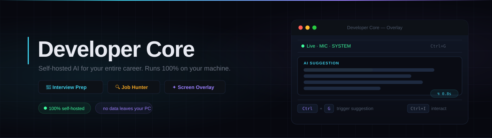

<div align="center">



<br/>

[](https://github.com/Siteforlio/dev-core/stargazers)
[](LICENSE)
[](CONTRIBUTING.md)
[](https://github.com/Siteforlio/dev-core/releases/latest)

**[Download](https://github.com/Siteforlio/dev-core/releases/latest)  ·  [Docs](https://siteforlio.github.io/dev-core)  ·  [Contributing](CONTRIBUTING.md)  ·  [Discussions](https://github.com/Siteforlio/dev-core/discussions)**

</div>

---

## Three modules. One machine.

| | Module | What it does |
|---|---|---|
| 🎤 | **Interview Prep** | AI mock interviewer across 10 career tracks, 5 seniority levels, 8 interview stages. Voice-first. Pass/fail gates. Scored debrief. |
| 🔍 | **Job Hunter** | Scrapes jobs daily from 6 boards, tailors your resume per listing with AI, manages applications end-to-end, syncs with your inbox and calendar. |
| ✦ | **Screen Overlay** | Real-time AI layer invisible to screen capture and proctoring software. Listens to live audio, surfaces suggestions in under a second. Never leaves your machine. |

---

## 🎤 Interview Prep

<details>
<summary><b>Expand — tracks, stages, scoring</b></summary>

<br/>

Practice against a realistic AI interviewer calibrated to your exact role and company type — not a generic Q&A bot.

**10 career tracks**

> Backend · Frontend · Fullstack · Mobile · DevOps/Platform · Data Engineering · ML/AI Engineering · QA/SDET · Product Engineering · Security Engineering

**5 seniority levels** — Junior through Staff/Principal, each with calibrated question depth and expected answer frameworks.

**8 interview stages** with enforced time budgets and pass/fail gates:

| Stage | What it simulates |
|---|---|
| Phone Screen | Recruiter call — motivation, role fit, logistics |
| Technical Screen | First engineer call — fundamentals, problem solving |
| HR Interview | Culture fit, compensation, team dynamics |
| Hiring Manager | Vision alignment, leadership signals |
| Skills Assessment | Live coding or take-home equivalent |
| Panel Interview | Multi-stakeholder pressure |
| Case Presentation | Architecture, product, or business case |
| Offer Negotiation | Compensation framing and anchoring |

**Behavioral signal detection** — tracks hesitation timing, answer rewrite count, and response confidence to produce a hire/no-hire recommendation — not just a score average.

**Scored debrief** after every session:

> Communication · Time Management · Pressure Handling · Structure · Depth · track-specific dimensions (Code Reasoning, System Design Clarity, etc.)

**Universal simulation engine** — pitch practice, system design sessions, code review simulations, teaching exercises. Upload your resume, JD, or prep notes and the AI grounds its questions in your actual materials.

</details>

---

## 🔍 Job Hunter

<details>
<summary><b>Expand — scraping, tailoring, applications</b></summary>

<br/>

Describe the job you want in plain English. The AI configures the campaign, sets up the scraper, and runs the first batch — all in one conversation.

**Multi-board scraping** — LinkedIn, RemoteOK, We Work Remotely, Adzuna, Scrapfly-powered boards. Runs daily. Deduplicates across boards and campaigns automatically.

**AI resume tailoring** — each scraped listing triggers automatic resume tailoring. Rewrites bullet points to mirror the JD language and priorities without fabricating experience. Generates a per-job PDF stored locally.

**BERT job scoring** — every listing is scored against your profile before you see it. You only review matches that actually matter.

**Email & calendar integration** — connects to Google and Microsoft accounts via OAuth. Monitors your inbox for interview invitations and recruiter replies. Auto-creates calendar events from scheduling emails.

**Chrome extension auto-fill** — reads your campaign profile and fills application forms on Greenhouse, Lever, Workday, and most ATS platforms. One click per listing from the dashboard.

</details>

---

## ✦ Screen Overlay

<details>
<summary><b>Expand — stealth, audio, AI response pipeline</b></summary>

<br/>

An AI layer invisible to screen capture, screen share, and proctoring software. It listens, thinks, and answers — while remaining completely hidden from recordings.

**Invisible by design** — uses `WDA_EXCLUDEFROMCAPTURE` (Win32 API) to exclude the overlay window from all screen capture APIs on Windows 11. Any recording or proctoring tool sees only your desktop behind it.

**Live audio transcription** — captures microphone and system audio simultaneously via WASAPI loopback. Transcribes locally using Whisper — no audio leaves your machine. A BERT classifier pre-triggers the AI the moment a question is detected, before you finish listening.

**Sub-second response pipeline** — audio → transcription → AI response in under 1 second. The overlay shows a thinking state within 30ms of your hotkey press — before the backend even responds.

**Session context & RAG** — upload your resume, JD, prep notes, or code files at session start. Every response greedily pulls relevant chunks from what you uploaded.

**Live code execution** — run Python, Node, Go, Rust, and more directly from the overlay sidebar. The AI sees your output and iterates.

> **On use during interviews:** The overlay is a confidence aid — not a substitute for preparation. It surfaces things you already know when pressure makes you blank. Interviewers notice scripted-sounding answers.

</details>

---

## Keyboard Shortcuts

All hotkeys use a polled key state approach (`GetAsyncKeyState` / `CGEventSourceKeyState`) — no registered hotkeys, no `SetWindowsHookEx`. Invisible to keyboard monitors and proctoring software.

| Shortcut | Action |
|---|---|
| <kbd>Ctrl</kbd> + <kbd>Space</kbd> | Show / hide overlay |
| <kbd>Ctrl</kbd> + <kbd>G</kbd> | Trigger AI suggestion |
| <kbd>Ctrl</kbd> + <kbd>Enter</kbd> | Start session |
| <kbd>Ctrl</kbd> + <kbd>/</kbd> | Focus ask input |
| <kbd>Ctrl</kbd> + <kbd>S</kbd> | Capture screenshot and send to AI |
| <kbd>Ctrl</kbd> + <kbd>X</kbd> | Clear screenshot buffer |
| <kbd>Ctrl</kbd> + <kbd>I</kbd> | Toggle interact mode |
| <kbd>Ctrl</kbd> + <kbd>R</kbd> | Re-trigger thinking state |
| <kbd>Ctrl</kbd> + <kbd>→</kbd> | Move overlay right |
| <kbd>Ctrl</kbd> + <kbd>←</kbd> | Move overlay left |
| <kbd>Ctrl</kbd> + <kbd>↓</kbd> | Move overlay down |
| <kbd>Ctrl</kbd> + <kbd>↑</kbd> | Move overlay up |
| <kbd>Ctrl</kbd> + <kbd>Shift</kbd> + <kbd>↓</kbd> | Scroll suggestion card down |
| <kbd>Ctrl</kbd> + <kbd>Shift</kbd> + <kbd>↑</kbd> | Scroll suggestion card up |

---

## Setup

### Option 1 — Installer (recommended)

> No Python or Node installation needed. The installer bundles everything.

<div align="center">

**[↓ Download for Windows](https://github.com/Siteforlio/dev-core/releases/latest)**

</div>

---

### Option 2 — Run from source

**Requirements:** Node 20+, Python 3.11+

```bash
git clone https://github.com/Siteforlio/dev-core.git
cd dev-core

# Install frontend + Electron deps
npm install

# Set up Python backend
cd backend
python -m venv venv
source venv/Scripts/activate    # Windows: venv\Scripts\activate
pip install -r requirements.txt
cd ..

# Configure environment
cp backend/.env.example backend/.env
```

Generate a strong JWT secret (required — the app refuses to start without one):

```bash
python -c "import secrets; print('JWT_SECRET=' + secrets.token_hex(32))"
```

Add the output to `backend/.env`, then fill in the API keys below:

| Key | Get it here | Free tier |
|---|---|---|
| `JWT_SECRET` | Generate locally (command above) | — |
| `DEEPSEEK_API_KEY` | [platform.deepseek.com](https://platform.deepseek.com/api_keys) | ✓ |
| `DEEPGRAM_API_KEY` | [console.deepgram.com](https://console.deepgram.com) | 200 hrs/month |
| `GROQ_API_KEY` | [console.groq.com](https://console.groq.com/keys) | ✓ |
| `GEMINI_API_KEY` | [aistudio.google.com](https://aistudio.google.com/app/apikey) | ✓ |
| Google OAuth | [console.cloud.google.com](https://console.cloud.google.com) | ✓ |
| Microsoft OAuth | [portal.azure.com](https://portal.azure.com) | ✓ |
| `ADZUNA_APP_ID` + key | [developer.adzuna.com](https://developer.adzuna.com) | ✓ |

Start the app:

```bash
npm run dev
```

---

## Tech Stack

| Layer | Technology |
|---|---|
| Desktop shell | Electron 28+ |
| Frontend | React 18 + TypeScript + Tailwind CSS + Vite |
| Backend | FastAPI (Python 3.11+) |
| LLM | DeepSeek (primary) · Gemini Flash |
| Transcription | Deepgram · Whisper via Groq |
| Job scoring | BERT (runs locally — no API) |
| Audio capture | WASAPI loopback · PyAudioWPatch |
| Database | SQLite · aiosqlite |
| Auth | JWT · refresh token rotation · JTI blacklist |
| Stealth overlay | Win32 `WDA_EXCLUDEFROMCAPTURE` via koffi |

---

## Contributing

Contributions are welcome. Read [CONTRIBUTING.md](CONTRIBUTING.md) before opening a PR — covers branch naming, commit format, code style, and test commands.

Every PR auto-loads a checklist: tests, type check, ARCHITECTURE.md layering rules, CHANGELOG and docs updates.

Not sure where to start? → [`good first issue`](https://github.com/Siteforlio/dev-core/issues?q=is%3Aissue+is%3Aopen+label%3A%22good+first+issue%22)

For large features → open a [Discussion](https://github.com/Siteforlio/dev-core/discussions) first.

---

## Community

[GitHub Discussions](https://github.com/Siteforlio/dev-core/discussions) — Q&A, ideas, show & tell  
[Issues](https://github.com/Siteforlio/dev-core/issues) — bugs and feature requests

---

<div align="center">

MIT License · [Siteforlio/dev-core](https://github.com/Siteforlio/dev-core)

</div>
